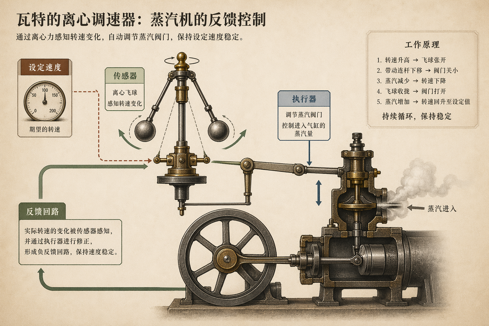
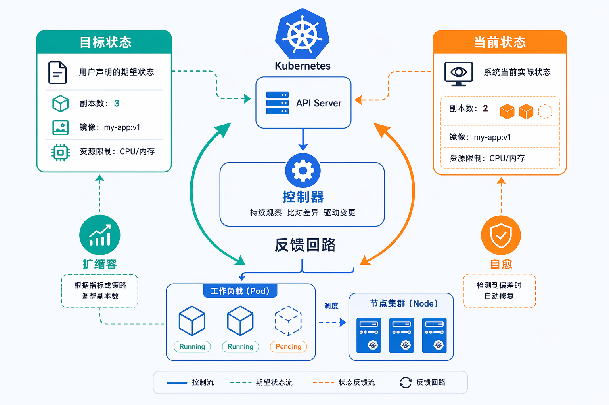
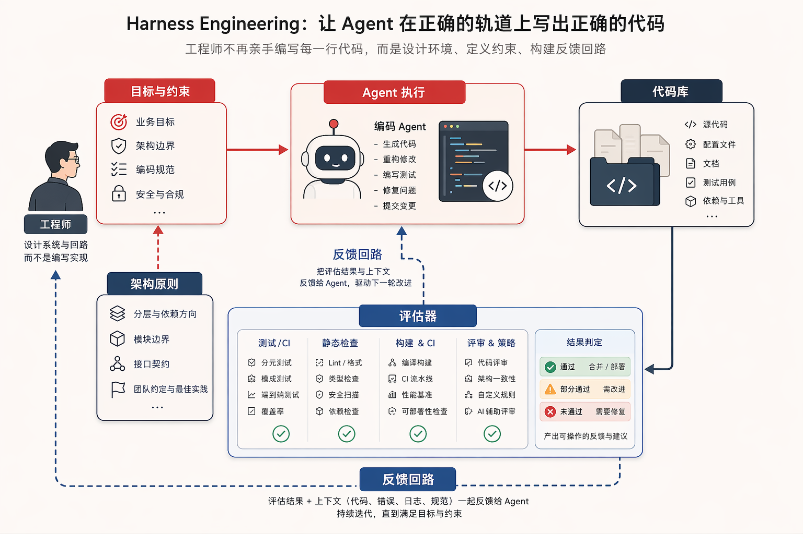
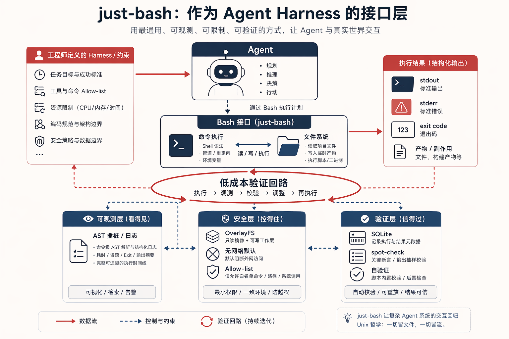

<!-- _class: lead -->

# 从写代码到掌舵

## `harness engineering` 与控制论的第三次轮回

<br>

<span class="small">内部分享 · 2026</span>

---

## 一个反直觉的数字

Vercel 把内部 agent 的 bespoke tools 全删了，换成 `bash` + `filesystem`。

<br>

**Claude Opus 4.5 上，sales call summarization agent：**

- 单次成本 ~$1.00 → **~$0.25**
- 输出质量**反而更好**

<br>

> 为什么"最原始"的工具，赢了"最贴合"的工具？

<span class="small">Source: vercel.com/blog/how-to-build-agents-with-filesystems-and-bash</span>

---

## just-bash 是什么

`vercel-labs/just-bash` — 给 agent 一个 `exec(cmd)`，世界表示为**文件系统**。

<br>

**核心约束：**
- 默认无网络；开启时走 URL / method allow-list
- OverlayFS：读真实目录，写入只停留在内存
- 循环、递归、命令数量的执行上限
- 每次 `exec()` 重置 env / 函数 / cwd，只共享文件系统

<br>

<span class="small">持久状态只存在于文件里——消灭隐藏状态。</span>

---

## 现场：最小示例

<br>

```bash
# 切到终端
$ npx just-bash
> exec("ls && cat README.md | head -30")
```

<br>

**观众看到的：** 模型用 bash 探索环境、读文件、拿到 stdout。

---

## "就这？"

<br><br>

# 对，就这。

<br>

接下来 15 分钟，我告诉你为什么"就这"**背后是一次范式转移**。

---

## 第一次：Watt 离心调速器（1788）



蒸汽机旁边**不再需要站着人拧阀门**。

<br>

工人没消失，工作变了：

- 从亲手拧阀门
- **到设计会自动调节的装置**

---

## 第二次：Kubernetes



声明目标状态 → controller 持续比较 → 自动 reconciliation。

<br>

> "Kubernetes" 源自希腊语：**舵手**

<br>

工程师退出"重启服务、补副本"的循环，上升到**定义期望状态**。

---

## 第三次：Agent + 代码



工程师越来越少亲手实现。

<br>

新工作：

- 设计环境
- 定义约束
- 搭建反馈回路
- 让 agent 在回路里生成、修改、验证

---

## 同一种模式

<br>

> 当某一层第一次同时拥有**足够强的传感器**和**足够强的执行器**，
> 人类就从该层的直接操作中退出来，
> 上升到**更高一层去设定目标、校准回路、处理异常**。

<br>

Watt / Kubernetes / Agent——**同一张图的三个版本。**

---

## 为什么代码是最后一个堡垒

过去代码工程只在**低层**闭环：

- 编译器检查语法
- 测试检查行为
- Lint 检查风格

<br>

**高层语义**过去只有人能判断：架构是否合理？抽象是否会失效？边界是否会失控？

<br>

大模型第一次把**高层语义的感知 + 行动**同时带了进来。

---

## 闭环 ≠ 可靠

<br>

**Ashby's Law of Requisite Variety：只有多样性能抵消多样性。**

<br>

代码库越复杂，控制系统越不能只靠一句 prompt。需要：

- 分层清晰的架构文档
- 可执行的边界规则（lint / test）
- **可解析**的 CI 输出（不是噪音）
- 真实运行时信号
- 把错误重新喂回系统的反馈机制

<br>

<span class="small">这些不是 agent 的"辅助材料"，它们**就是控制器的一部分**。</span>

---

## 最容易被忽略的一条

<br>

**Conant-Ashby 定理：好的调节器必须是被调系统的模型。**

<br>

翻译成人话：

> agent 总做错，不是它不够聪明，
> 是我们根本没把"什么叫好"**外化**出来。

<br>

那些锁在资深工程师脑子里的判断——哪些依赖方向允许、哪些模式一定会烂、哪些边界不能碰——**对 agent 来说不存在。**

---

## 范式转移：三个问题

<br>

过去是"工程卫生"，现在是**生产力前提**。

<br>

1. 我们代码库里，哪些"正确"**还只活在少数人脑子里**？
2. 我们给 agent 的反馈，是**可解析信号**还是噪音？
3. 我们在给 agent 造 **bespoke tools**，还是**通用接口**？

---

## 接口选择：bash 不是怀旧

<br>

> **grep, cat, find, awk. These aren't new skills we're teaching.
> LLMs have seen these tools billions of times.**
>
> <span class="small">— Vercel, *How to build agents with filesystems and bash*</span>

<br>

与其发明专有动作语言，不如用模型**已经内化**的通用语法。

<br>

Vercel 实验结论：**bash + SQLite 混合 > 纯 bash > bespoke tools**。
赢家不是单次 raw accuracy，是 **self-verification 带来的稳定 accuracy**。

---

## 不只是工具选择，是 context 策略

<br>

| 方案 | 问题 |
|---|---|
| Prompt stuffing | token 上限 |
| Vector search | 语义近似，不精确 |
| **Filesystem + bash** | on-demand loading + exact match |

<br>

> A large transcript doesn't go into the prompt upfront.
> The agent reads the metadata, greps for relevant sections,
> then pulls only what it needs.

---

## Goodhart 警告

<br>

**当指标变成目标，它就不再是好指标。**

<br>

会被刷的代理指标：

- 测试通过率
- PR 吞吐量
- Benchmark 分数
- Review 速度

<br>

成熟 harness = **多传感器互校**，不是单指标驱动。

---

## 我们自己的尝试：Nova X1 incident response



一个内部 demo：

- 读多源数据（social posts / tickets / rules / logs）
- 改业务代码（normalize / risk-score / escalation）
- 跑测试 + lint
- 产出 `escalation-decision.json` + `incident-brief.md`
- `incident-guard` 验证

<br>

<span class="small">像工程师逛 codebase 一样，让 agent 逛业务数据。</span>

---

## 现场跑（scripted replay）

<br>

```bash
$ npm run demo -- --scripted
```

<br>

边跑边指：

- **传感器** — stdout / stderr / exitCode / test results
- **执行器** — bash (`exec`)
- **约束** — OverlayFS / 无网络 / 执行上限
- **模型** — 外化在 rules / tests / guard 里

---

<!-- _class: lead -->

# 收尾

<br>

> Watt 时代真正进步的人，
> 不是把阀门拧得更熟练的人，
> 是**意识到不该再让人一直站在阀门旁边**的人。

<br>

今天的软件工程，大概也走到这个时刻。

<br><br>

<span class="small">Q&amp;A</span>
